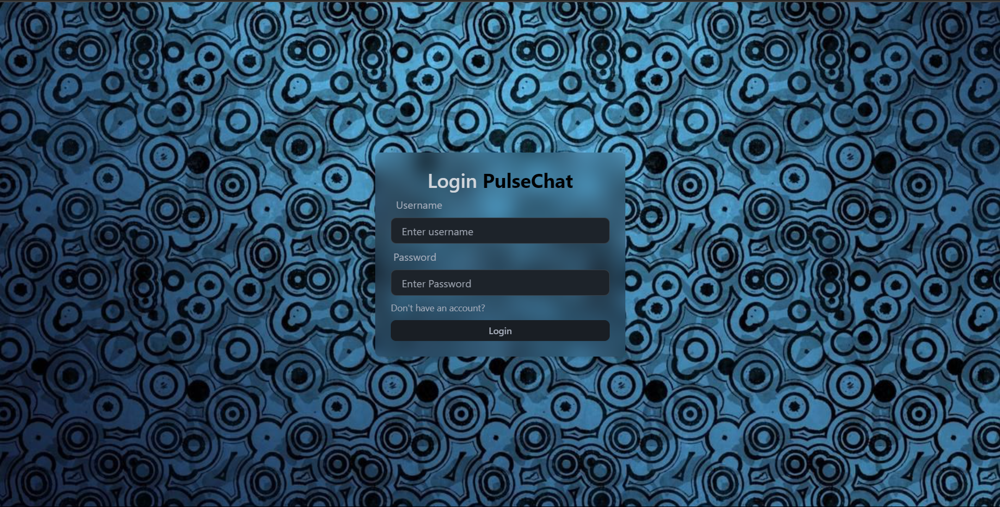
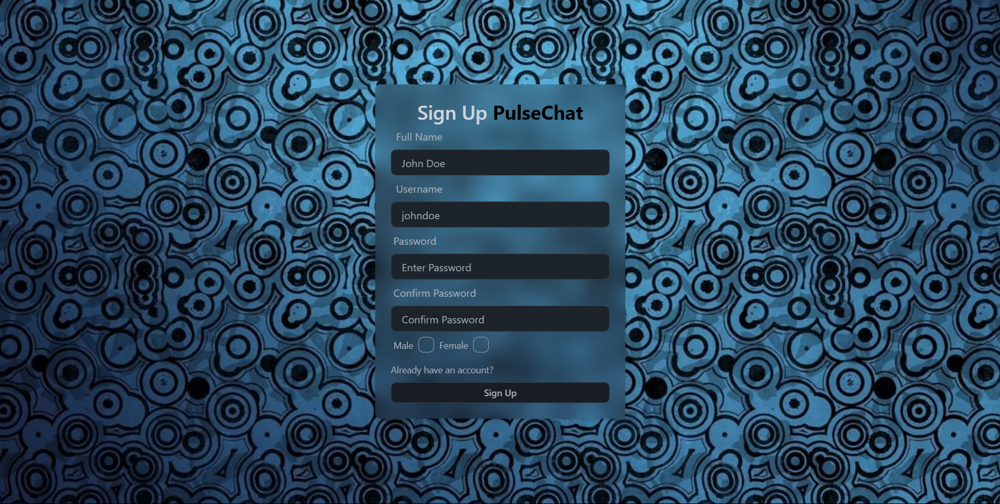
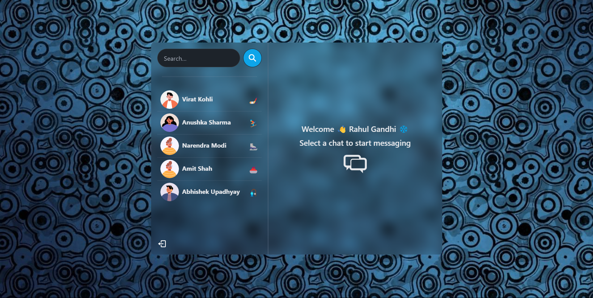
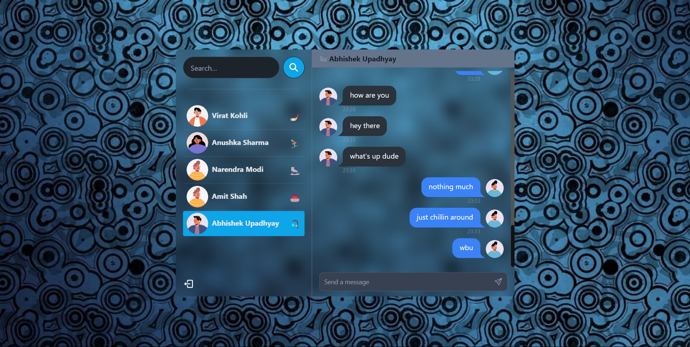

# PulseChat ✨

PulseChat is a real-time chat application built using the MERN (MongoDB, Express.js, React.js, Node.js) stack. It utilizes JSON Web Tokens (JWT) for authentication and authorization, as well as Socket.io for real-time communication between clients and the server.

## Features

-   Real-time messaging: Instantly chat with other users in real-time.
-   User authentication: Securely authenticate users using JSON Web Tokens.
-   Responsive design: Enjoy a seamless experience across various devices and screen sizes.
-   User-friendly interface: Intuitive design for ease of use.

## Technologies Used

-   **MongoDB**: NoSQL database used to store user data and chat messages.
-   **Express.js:** Web application framework for Node.js, used for building the server-side application.
-   **React.js:** JavaScript library for building user interfaces, used for the frontend of the application.
-   **Node.js:** JavaScript runtime environment used to execute server-side code.
-   **JSON Web Tokens (JWT):** Token-based authentication mechanism used to verify the identity of users.
-   **Socket.io:** Library for real-time web applications, facilitating bidirectional communication between clients and the server.

## Screenshots

### Login Page



### Sign Up Page



### Home Page



### Conversation



## Installation

1. Clone the repository:

```bash
git clone https://github.com/yourusername/pulsechat.git
```

2. Navigate to the project directory:

```bash
cd <folder_name>
```

3. Install dependencies for both the client and server:

```bash
cd client
npm install
cd ../server
npm install
```

4. Set up environment variables:
    - Create a .env file in the server directory.
    - Define the following variables in the .env file:

```makefile
PORT=5000
MONGODB_URI=your_mongodb_connection_string
JWT_SECRET=your_jwt_secret
```

5. Start the server:

```sql
npm start
```

6. Start the client:

```bash
cd ../client
npm start
```

7. Open your browser and navigate to http://localhost:3000 to use PulseChat.

## Contributing

Contributions are welcome! Please feel free to submit any issues or pull requests.

## Acknowledgements

This project was inspired by the need for a real-time chat application.
Special thanks to the creators and maintainers of the MERN stack, JWT, and Socket.io for their invaluable contributions to the development community.
